# MunchMate - Your Hassle-Free Canteen Ordering Solution

## With Web Hosted Admin Panel made with Flutter only

MunchMate is a Flutter app designed to simplify the snack ordering process for students. Say goodbye to long lines, paper receipts, and waiting for your order at the canteen. With MunchMate, you can place your snack order from your phone and receive it without any hassle.

## Features

- **Order Snacks Easily**: Students can order snacks from the canteen with just a few taps on their phones.

- **Quick Confirmation**: After placing an order, students receive a QR code, which is scanned at the canteen to confirm the order.

- **Real-Time Updates**: MunchMate uses Firebase's Cloud Firestore and Realtime Database to ensure real-time updates between users and admin.

- **Admin Panel**: Admins can manage the availability of items and the status of orders through a web-based admin panel.

- **No More Chaos**: Eliminate the chaos at the canteen caused by long queues and manual order processing.

## Screenshots

**User**

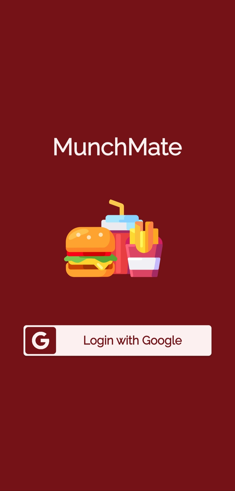 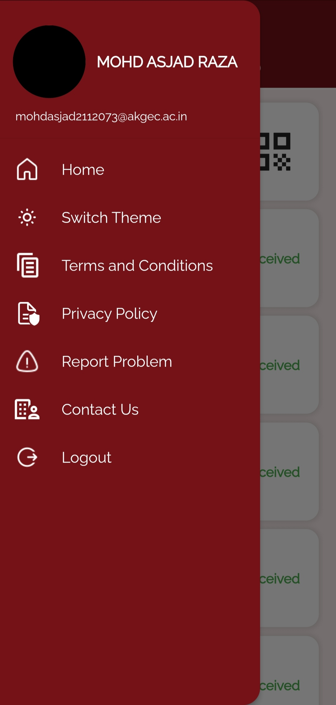

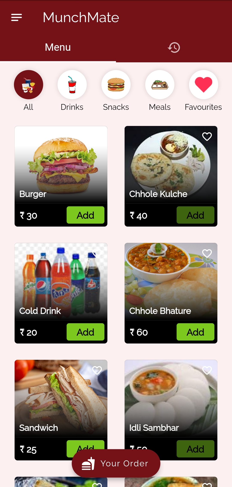 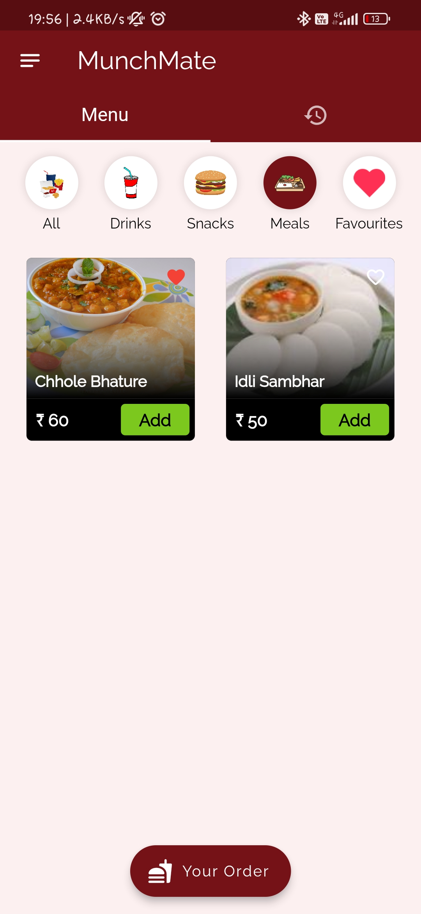 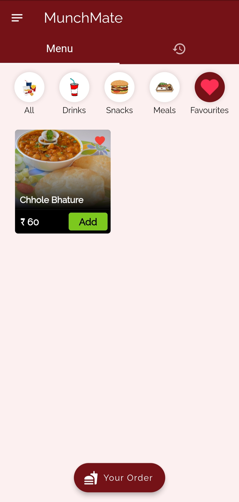 

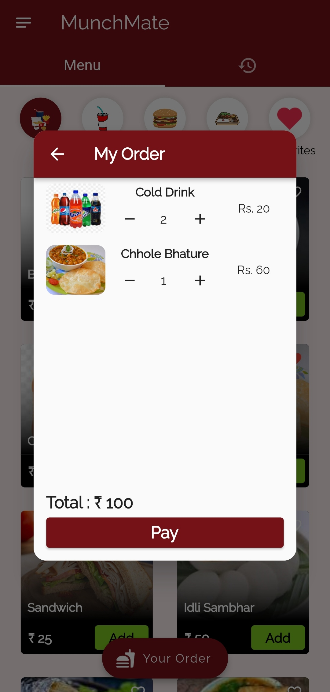 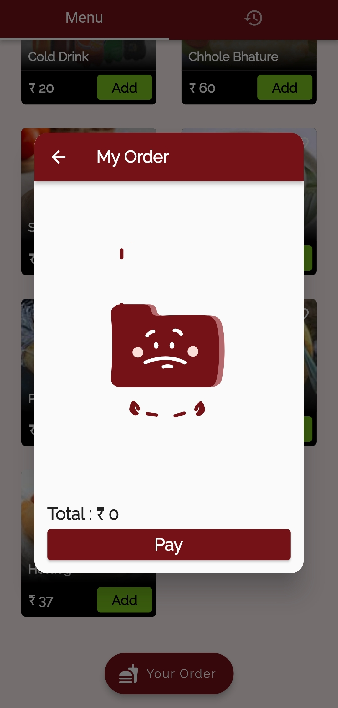 

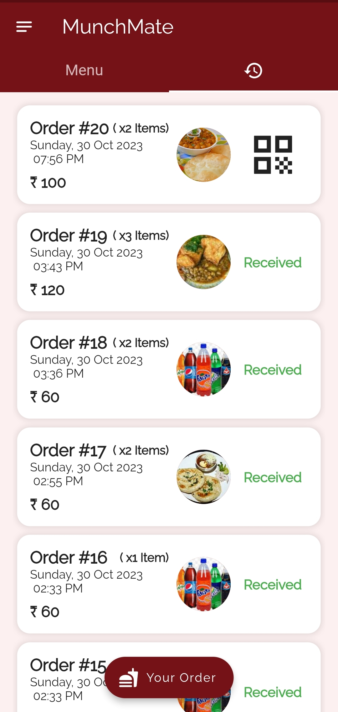 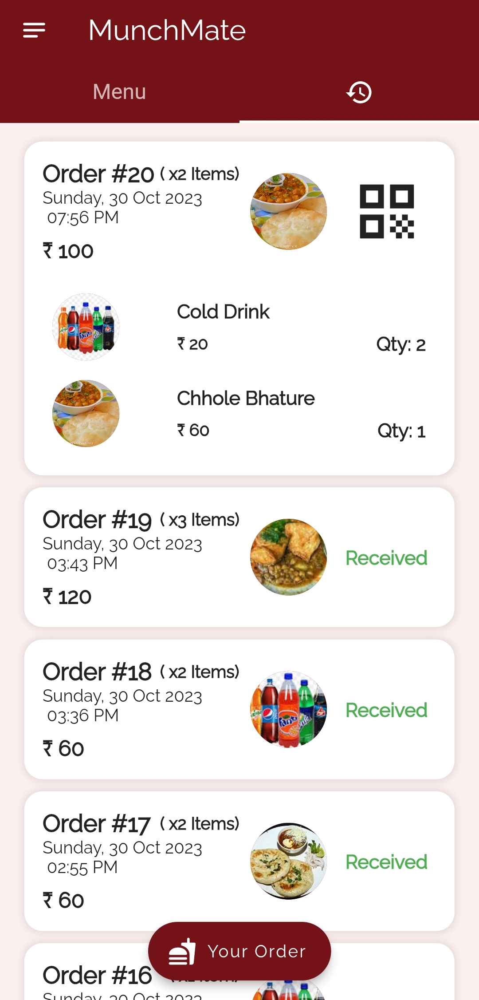 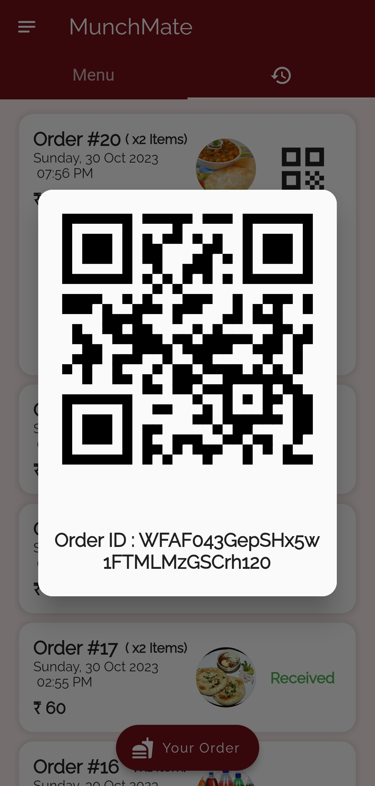

**Admin**

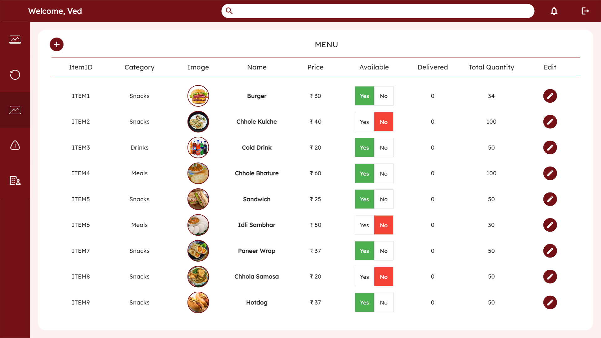

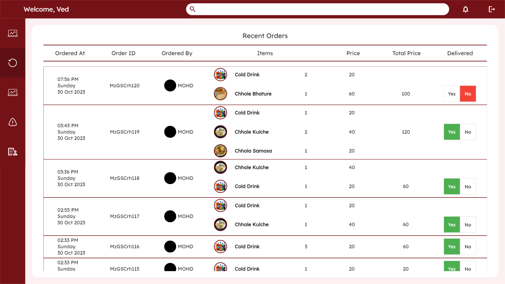

## Usage

1. Open the app and log in or sign up.

2. Browse the available items in the canteen menu.

3. Add items to your cart.

4. Place your order and receive a QR code.

5. Present the QR code at the canteen for order confirmation and enjoy your snacks.

## Admin Panel

Admins can use the web-based admin panel to manage the canteen items and orders.

- From the admin panel, you can:
  - Toggle item availability.
  - Toggle order status (delivered or not delivered).

Changes made in the admin panel will be reflected in real-time for users.

## Under Development

MunchMate is a one-person project in active development. New features and improvements are in the pipeline. Stay tuned for updates.
